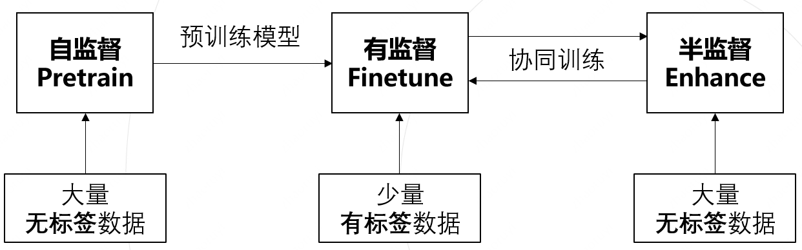

# 基于室内无人机航拍图像的绿叶菜表型分析
**项目背景:** 上海市科技兴农重点攻关项目&本人硕士毕设课题

**研究内容** 
+ 设计基于航拍图像的绿叶菜虫害检测方法，完成对上海地区大棚内绿叶菜常见虫害的**目标检测**, 目的: **定点喷洒农药**
+ 设计基于航拍图像的绿叶菜生长监测方法， 完成对绿叶菜植株叶片的**实例分割**，目的: **监测生长情况**

## 虫害检测
**目的:** 为植保无人机喷晒农药提供感知基础
+ 定点喷晒: 将虫害像素级坐标转换为物理世界坐标, 定点喷晒
+ 实时喷晒: 由当前视野下的虫害情况，直接判断是否喷晒

**技术栈:** 目标检测

**技术路线:** 见[虫害检测](./1.虫害检测/)

**成果:** 投稿SCI论文一篇

## 生长监测
**目的:** 预测成熟度
+ 由植株叶片面积, 计算生长曲线, 进而预算绿叶菜成熟度

**技术栈:** 实例分割

**技术路线:** 结合**自监督/半监督**推动落地

 

